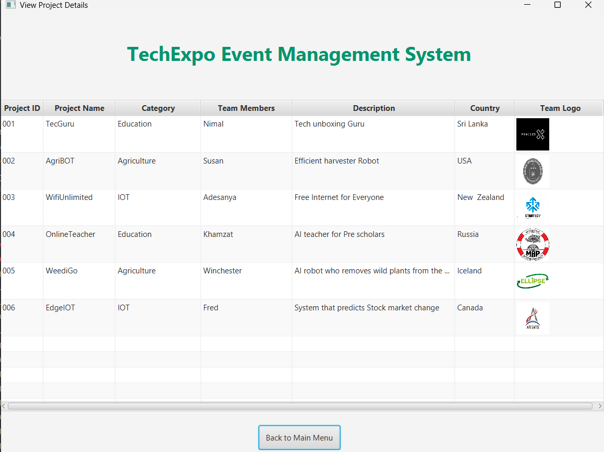
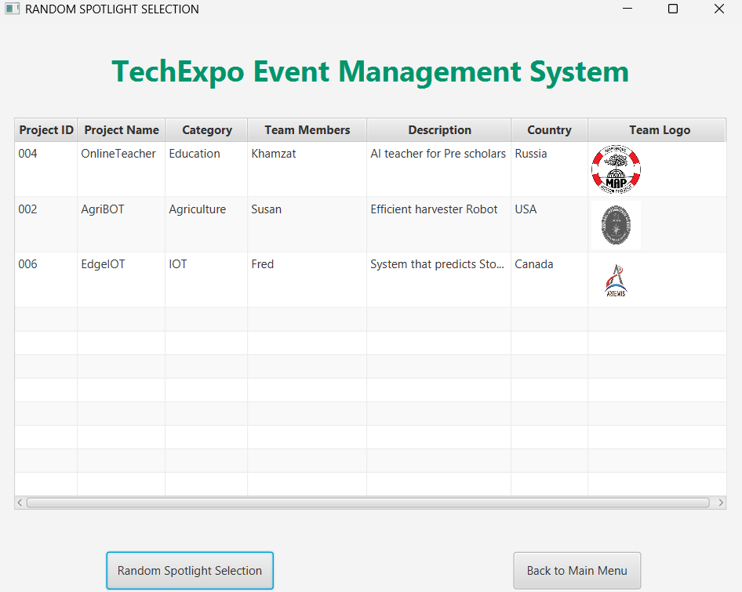
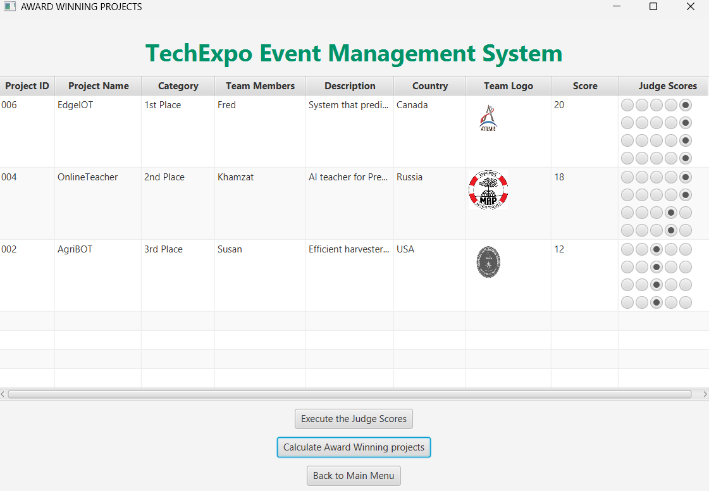
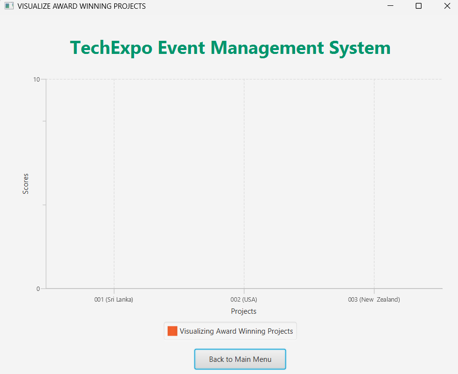

# TechExpo-Event-Management-System-JAVA
TechExpo is a technology showcase event where innovative tech projects are presented. To streamline the event management process, here is a GUI made with JavaFX which will handle project registration, updates, deletions, viewing, saving, visualizing and spotlighting the award-winning projects.

---

## 🚀 Overview

-TechExpo Event Management System uses a JavaFX GUI to guide through each functionality that is implemented to demonstrate this annual technology showcase event.
-Below are the functionalities implemented in the System.

01) Adding Project Details
02) Updating Project Details
03) Deleting Project Details
04) Viewing Project Details
05) Saving Project Details to Text File
06) Random Spotlight Selection
07) Recording Awards and Recognitions
08) Visualizing Award-Winning Projects
09) Exiting the Program

---

## 🧠 Features

1. System facilitates addition, updating, deletion of project details and viewing them in the GUI with separate stages or windows.
2. Allows user to uniquely identify and easy to access the functionality they want without making it complex.
3. When the user inserts projects details, update or delete, the system is designed to save those in a text file.
4. In the Random Spotlight Selection (RSS) Functionality, it will choose one project from each category and display those in a table with its details.
5. When it comes to Record Award Winning Projects Functionality, it loads the projects from RSS and gives the user to input the scores of 4 Judges (out of 5), calculates the total score and shows the 1st place,2nd place, 3rd place in a table.
6. Visualizing Award-Winning Projects Functionality uses the above top projects and depicts them in a bar chart graphically with the X-axis as the projectID, Country and Y-axis as the score respectively.
7. To exit the system you can click the “Exit” button and exit the main-menu GUI easily.

---

## 🧰 Tech Stack

| Tool       | Description               |
|------------|---------------------------|
| **Java**   | Core Programming Language |
| **JavaFX** | GUI Framework              |
| **.txt**   | Persistent storage backend |
---

## 🗂️ Project Structure

```bash
TechExpo-Event-Management-System-JavaFX/
├── java                  
│   ├── AddingProjectDetailsController.java
│   ├── AwardWinningProjectsController.java
│   └── DeletingProjectDetailsController.java
│   └── MainApplication.java # Launcher
│   └── MainController.java
│   └── Project.java
│   └── ProjectManager.java
│   └── RandomSpotlightSelectionController.java
│   └── UpdatingProjectDetailsController.java
│   └── ViewingProjectDetailsController.java
│   └── VisualizingAwardWinningProjectsController.java
├── resources
│   ├── AddingProjectDetails.fxml
│   ├── AwardWinningProjects.fxml
│   └── DeletingProjectDetails.fxml
│   └── Main.fxml
│   └── RandomSpotlightSelection.fxml
│   └── UpdatingProjectDetails.fxml
│   └── ViewingProjectDetails.fxml
│   └── VisualizingAwardWinningProjects.fxml
```

 
---

## 📸 Screenshots

### Main GUI


### Viewing Project Details


### Random Spotlight Selection


### Award Winning Projects


### 🪑 Visualizing Award Winning Projects


---

## 📦 Installation & Run

### 1. ✅ Clone the repo

```bash
git clone https://github.com/zurii-07/TechExpo-Event-Management-System-JAVA.git
cd TechExpo-Event-Management-System-JAVA
```

### 2.📦 Create Virtual Env (optional)

```bash
python -m venv .venv
source .venv/bin/activate  # or .venv\Scripts\activate
```

### 3.💡 Install dependencies

```bash
pip install -r requirements.txt
```

### 4.🧨 Run the App

```bash
python MainApplication.java
```

### 🧑‍🎓 Author

Surakkitha Galappaththi – [LinkedIn](https://www.linkedin.com/in/surakkitha-galappaththi-001588290)
Data Science | AI Engineer | Python Enthusiast
Email: surakkithag@gmail.com

### 📄 License

MIT License
